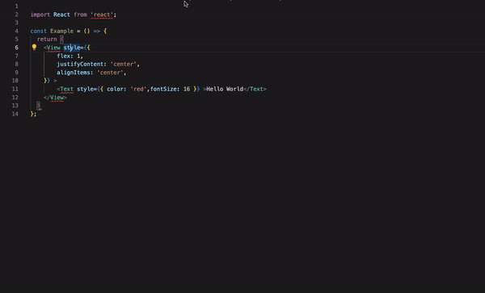

# Inline CSS to React StyleSheet

A VS Code extension that converts inline React/React Native styles to StyleSheet.create objects. This extension helps you maintain cleaner code by automatically extracting inline styles into reusable StyleSheet objects.


## Features

- Convert inline styles to StyleSheet.create objects with a right-click
- Automatically generates meaningful style names based on component names
- Adds new styles to existing StyleSheet.create objects if present
- Maintains proper formatting and indentation
- Works with both .tsx and .jsx files
- Handles complex style objects including conditional styles and expressions

## Installation

1. Open VS Code
2. Press `Ctrl+P` (Windows/Linux) or `Cmd+P` (Mac)
3. Type `ext install inlinecss2react`
4. Press Enter

## Usage

### Converting Inline Styles

1. Place your cursor on or near a style property in your React/React Native component
2. Right-click and select "Convert Inline Style to React Style Object" from the context menu
3. The inline style will be automatically converted and added to a StyleSheet.create object

### Examples

#### Before:
```tsx
const MyComponent = () => {
    return (
        <View style={{ padding: 16, backgroundColor: 'white', marginBottom: 8 }}>
            <Text>Hello World</Text>
        </View>
    );
};
```

#### After:
```tsx
const styles = StyleSheet.create({
    view: {
        padding: 16,
        backgroundColor: 'white',
        marginBottom: 8
    }
});

const MyComponent = () => {
    return (
        <View style={styles.view}>
            <Text>Hello World</Text>
        </View>
    );
};
```

### Adding to Existing StyleSheet

If your file already has a StyleSheet.create object, the extension will add the new style to it:

```tsx
// Existing styles
const styles = StyleSheet.create({
    container: {
        flex: 1
    }
});

// After converting an inline style
const styles = StyleSheet.create({
    container: {
        flex: 1
    },
    view: {
        padding: 16,
        backgroundColor: 'white'
    }
});
```

## Features

- ✅ Automatic style name generation
- ✅ Handles nested style objects
- ✅ Preserves comments and formatting
- ✅ Supports TypeScript and JavaScript
- ✅ Works with conditional styles and expressions
- ✅ Maintains proper indentation
- ✅ Prevents duplicate style names
- ✅ Skips already referenced styles

## Requirements

- VS Code 1.85.0 or higher
- React/React Native project

## Extension Settings

This extension doesn't require any additional settings.

## Known Issues

- The extension only works with `.tsx` and `.jsx` files
- Style names are generated based on component names and may need manual adjustment for better semantic meaning

## Contributing

Found a bug or have a feature request? Please [open an issue](https://github.com/yourusername/inlinecss2react/issues) on our GitHub repository.

## Release Notes

### 1.0.0

- Initial release
- Basic inline style to StyleSheet.create conversion
- Right-click context menu support
- Automatic style name generation
- Support for existing StyleSheet objects

## License

This extension is licensed under the [MIT License](LICENSE).

---

**Enjoy!**